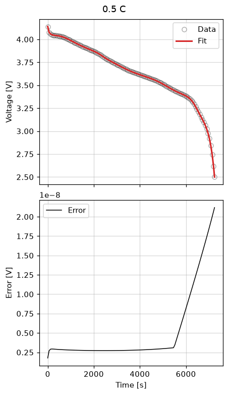

Current-driven fit
===================

Fit a negative-electrode exchange-current density from constant-current
discharge data with :class:`~ionworks_schema.objectives.CurrentDriven` and
:class:`~ionworks_schema.DataFit`.

.. literalinclude:: ../../../examples/current_driven.py
    :language: python
    :start-after: # --8<-- [start:example]
    :end-before: # --8<-- [end:example]
    :dedent:

