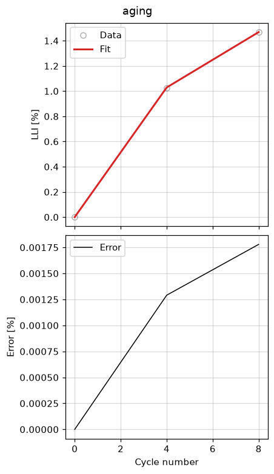

Cycle-ageing fit
================

Fit an SEI solvent diffusivity from cycle-ageing summary data (loss of lithium
inventory vs cycle number) with :class:`~ionworks_schema.objectives.CycleAgeing`
and :class:`~ionworks_schema.DataFit`.

This fits ``LLI [%]``, a built-in default metric, so it needs no ``metrics``
option. A custom metric is expressible too, as a ``metrics`` config — this one
is last-minus-first of the cycle-wise discharge capacity over each cycle's
first step::

    metrics = {
        "C/5 capacity [A.h]": {
            "type": "ComposedMetric",
            "operation": "sub",
            "left": {
                "type": "CyclewiseMetric",
                "step": 0,
                "metric": {"type": "Last", "variable": "Discharge capacity [A.h]"},
            },
            "right": {
                "type": "CyclewiseMetric",
                "step": 0,
                "metric": {"type": "First", "variable": "Discharge capacity [A.h]"},
            },
        }
    }

The summary data below has no discharge-capacity column to compare it against,
so this fit omits it.

.. literalinclude:: ../../../examples/cycle_ageing.py
    :language: python
    :start-after: # --8<-- [start:example]
    :end-before: # --8<-- [end:example]
    :dedent:

