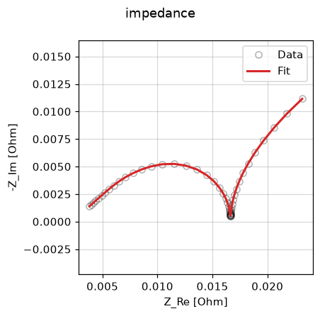

EIS fit
=======

Fit a negative-electrode exchange-current density from electrochemical
impedance spectroscopy (EIS) data with
:class:`~ionworks_schema.objectives.EIS` and :class:`~ionworks_schema.DataFit`.

.. literalinclude:: ../../../examples/eis.py
    :language: python
    :start-after: # --8<-- [start:example]
    :end-before: # --8<-- [end:example]
    :dedent:

