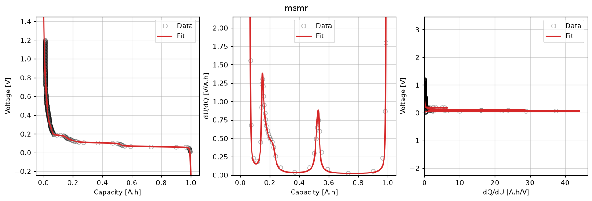

MSMR half-cell OCP fit
======================

Fit MSMR species parameters to negative-electrode half-cell open-circuit
potential data with :class:`~ionworks_schema.objectives.MSMRHalfCell`,
:class:`~ionworks_schema.models.MSMRHalfCellModel`, and
:class:`~ionworks_schema.DataFit`.

This fits one direction. For lithiation/delithiation hysteresis, set
``direction`` on :class:`~ionworks_schema.models.MSMRHalfCellModelOptions` and
give each direction its own objective; only the combined single-plot overlay has
no schema equivalent.

.. literalinclude:: ../../../examples/msmr_ocp.py
    :language: python
    :start-after: # --8<-- [start:example]
    :end-before: # --8<-- [end:example]
    :dedent:

